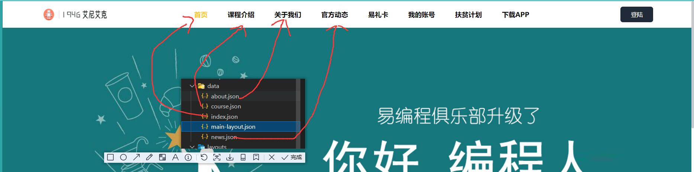
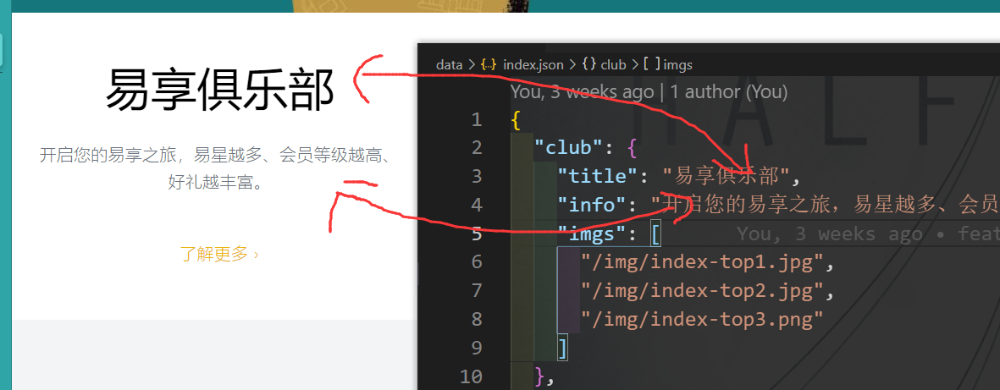
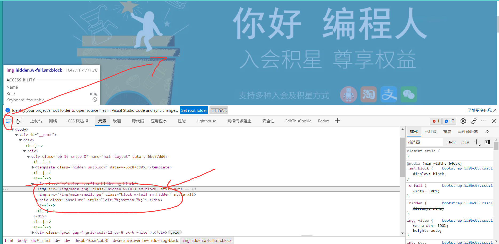
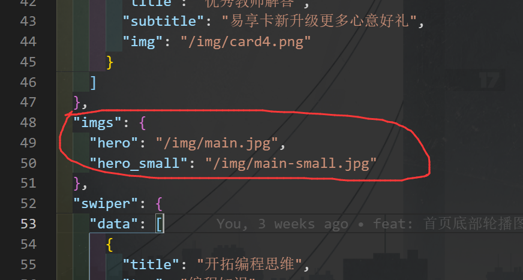

# 易编程官网

> 关于如何启动项目以及如何修改页面内容。
>
> *2022年1月31日12:01:59*

## 启动项目

注意：该项目采用`Nuxtjs3`编写，要想启动项目不能使用和`HTML`课设类似的形式，下面的内容就是从0开始介绍如何启动项目。

### 安装Nodejs

首先是安装`Nodejs`，推荐安装**最新版本**，`Nuxtjs3`要求至少安装`14.x`之前的版本。

下载链接：[下载 | Node.js 中文网 (nodejs.cn)](http://nodejs.cn/download/)

安装教程：[Nodejs安装及环境配置 - 简书 (jianshu.com)](https://www.jianshu.com/p/13f45e24b1de)

简单来说打开安装包一路`next`即可，注意记下安装路径。安装完成后设置环境变量为安装目录即可。

设置完环境变量后可以打开新`CMD`窗口，输入`node --version`查看`Nodejs`版本，如果没有报错则说明安装成功。

### 安装项目依赖

打开`CMD`（或你使用的`IDE`控制台）进入项目路径，例如我的是`F:\WebstormProjects\nuxt3-app`。

接下来使用`npm install`或者`yarn install`安装项目依赖。

考虑到`npm registry`的服务器是国外，因此依赖下载速度可能会非常慢，所以推荐使用`npm install --registry=https://registry.npm.taobao.org`命令采用淘宝镜像安装依赖。

### 启动项目

依赖安装完毕后即可启动项目。

#### 开发环境

**开发环境适用于对图片、文字修改的实时预览**。也就是说如果你想修改页面并查看效果，使用这种启动方式会比较合适。

使用`npm run dev`启动开发环境项目。执行这条命令后会进行各种编译，等待它执行完毕后应该会有如下提示：

```tex
  > Local:    http://localhost:3000/
  > Network:  http://192.168.204.1:3000/
  > Network:  http://192.168.237.1:3000/
  > Network:  http://192.168.2.153:3000/
```

复制（如果你使用的是`VSCode`，也可直接使用`ctrl + 左键单击`打开项目）`Local`中的链接在浏览器打开就可以看到页面了。

看完这部分你就可以尝试修改内容了。

#### 生产环境

如果你将想要修改的内容都修改了，并且想要发布新版本的项目，可以使用这种方式，它本质上来说是对项目的打包。

使用`npm run build`打包项目。执行这条命令后就会开始打包，等待打包完毕后会在项目根目录下生成一个`.output`文件，这里面便是打包后的项目文件。

打包完成后可以采用`npx nuxi preview`预览页面，注意这种方式才是真正放在服务器上运行的方式。如果在这种模式下你没有发现任何问题（例如资源丢失或内容未修改），那么就说明修改没有问题；如果你发现这种模式下出现了问题而生产环境没有问题，应检查是否有遵守下面提到的各种约定。

成功执行`preview`命令后会有类似下面的提示：

```tex
Nuxt CLI v3.0.0-27356801.e9128f3                                                                                                                           12:27:06
i Node.js version: 16.13.1                                                                                                                                 12:27:06
i Preset: server                                                                                                                                           12:27:06
i Working dir: .output                                                                                                                                     12:27:06  
i Starting preview command: node ./server/index.mjs                                                                                                        12:27:06  
                                                                                                                                                           12:27:06  
Listening on http://localhost:3000
```

复制`http://localhost:3000`在浏览器打开即可看到页面。

注意：只有在`.output`文件存在的情况下才可以预览页面，我也推荐在预览前先执行`npm run build`重新打包项目保证代码是最新的。

### 修改内容

下面介绍如何修改内容。

与`HTML`课设不同，修改页面内容（文字、图片）**不需要修改任何页面代码，只需要修改对应的数据文件即可**。

在项目根目录下有一个`data`文件夹，该文件夹中的文件数据就是不同页面的文字、图片数据。

#### 约定

在正式开始修改页面内容时，应遵守下面的约定，否则可能会出现意料外的错误：

1. **所有文件（图片）均采用英文命名**。**所有文件（图片）均采用英文命名**。**所有文件（图片）均采用英文命名**。
2. `data`数据文件（也就是`data`文件夹中的那些文件）中的字段名不可修改。
3. 图片资源的路径不可修改（统一放在`public/img`中）。
4. 修改内容时采用开发环境。

#### 文件含义

在`data`文件夹下数据文件的命名域页面一致，例如`index.json`对应的是首页，`about.json`对应的是关于。修改`index`页面的内容只需要修改`index.json`即可。

下图即是不同文件对应的页面关系。



在这里`main-layout.json`对应的是顶部导航栏的内容数据，包括`logo`图片、导航标题等内容，如果没有特殊需求无需变动。

#### 修改文字

要想修改页面文字，只需要去对应数据文件修改即可。

例如想要修改首页的“易享俱乐部”部分的文字，只需要在`index.json`中找到相同文字然后进行修改。



修改后保存文件，等待编译即可查看效果。

其它所有页面修改步骤同理，如果修改内容后出现了布局错误，可以使用空格填充内容。

#### 修改图片

这里以首页大图为例：

首先打开开发者工具，然后选中想要修改的图片：



可以发现有一个`img`标签中定义了图片路径和名称，接下来去对应页面的数据文件找同名路径，例如这里是`index.json`：



接下来将你的图片（假如命名为`higurashi.png`）复制到`public/img`中，然后将其改名为`main.jpg`，再将原图重命名或删除即可。

如果你不想采用这种方式，直接将图中的`/img/main.jpg`改为`/img/higurashi.jpg`也行（直接修改文件名即可，无需修改路径）。另外：首页大图在不同屏幕大小下展示图片不同，因此都要修改（虽然这里省略了）。

这两种修改方式的区别：第一种修改方式会将所有使用了命名为`main.jpg`的图片的页面修改；第二种方式则只会修改当前页面，可以根据需求选择不同方式。

最后强调：**所有图片采用英文命名**。